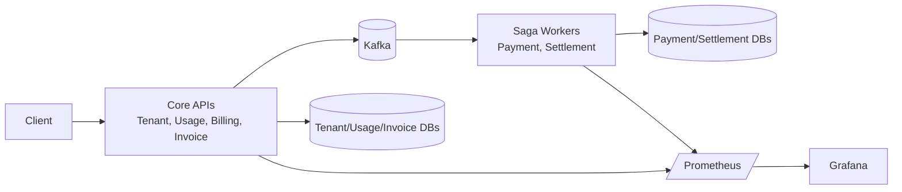

# Billing Platform Parent

<p align="left">
  <a href="https://www.java.com/" title="Java"></a>
  <a href="https://spring.io/projects/spring-boot" title="Spring Boot"></a>
  <a href="https://maven.apache.org/" title="Maven"></a>
  <a href="https://www.mongodb.com/" title="MongoDB"></a>
  <a href="https://kafka.apache.org/" title="Apache Kafka"></a>
  <a href="https://swagger.io/specification/" title="OpenAPI / Swagger"></a>
  <a href="https://junit.org/junit5/" title="JUnit 5"></a>
  <a href="https://prometheus.io/" title="Prometheus"></a>
  <a href="https://grafana.com/" title="Grafana"></a>
  <a href="https://www.docker.com/" title="Docker"></a>
  <a href="https://kubernetes.io/" title="Kubernetes"></a>
  <a href="https://github.com/features/actions" title="GitHub Actions"></a>
</p>

`billing-platform-parent` is a multi-tenant, usage-based billing reference project built with Spring Boot microservices.
It demonstrates an end-to-end billing lifecycle: tenant onboarding, usage ingestion, rating, invoice generation, payment processing, and settlement orchestration.
The project is designed as a practical playground for engineers who want production-style patterns such as idempotency, outbox/inbox reliability, quality gates, and observability.

- Business scope: tenant, usage, billing, invoice, payment, settlement
- Reliability patterns: idempotency, event-driven saga-like settlement flow, orchestration with outbox/inbox records
- Messaging backbone: Apache Kafka (payment/settlement orchestration events)
- Observability: Prometheus + Grafana + Loki
- Delivery pipeline: GitHub Actions CI/CD + SonarCloud + Gitleaks

## Highlights

- Multi-service domain split with shared cross-cutting layer (`billing-platform-common`)
- Idempotent write flows for usage ingestion, payment, settlement, and orchestration
- Outbox/inbox style reliability in invoice orchestration
- Event-driven orchestration between invoice, payment, and settlement services via Kafka
- Sonar quality gate and JaCoCo coverage in CI

## Architecture

### Services

- `billing-platform-common`: shared tenant context, idempotency, web/security filters, exceptions
- `tenant-service` (`8081`): tenant management
- `usage-service` (`8082`): usage ingestion and aggregate totals
- `billing-service` (`8083`): rating and charge calculation
- `invoice-batch-service` (`8084`): invoice generation and generate-and-settle orchestration
- `payment-service` (`8085`): payment processing facade
- `settlement-service` (`8086`): settlement saga start/query

### Diagram



## Prerequisites

- Docker Desktop
- Docker Compose
- Java 21

## Quick Start

1. Build and run all tests:

```bash
./mvnw -B -ntp clean verify
```

PowerShell:

```powershell
.\mvnw.cmd -B -ntp clean verify
```

2. Start local stack:

```bash
docker compose -f docker-compose.local.yml up -d --build
```

3. Check service readiness:

```bash
curl http://localhost:8081/actuator/health/readiness
curl http://localhost:8082/actuator/health/readiness
curl http://localhost:8083/actuator/health/readiness
curl http://localhost:8084/actuator/health/readiness
curl http://localhost:8085/actuator/health/readiness
curl http://localhost:8086/actuator/health/readiness
```

## Example API Flow

### 1) Create tenant

```bash
curl -X POST http://localhost:8081/api/v1/tenants \
  -H "Content-Type: application/json" \
  -d '{"tenantId":"tenant-demo","displayName":"Tenant Demo","currency":"USD"}'
```

### 2) Ingest usage event

```bash
curl -X POST http://localhost:8082/api/v1/usage/events \
  -H "X-Tenant-Id: tenant-demo" \
  -H "Idempotency-Key: usage-1" \
  -H "Content-Type: application/json" \
  -d '{"tenantId":"tenant-demo","customerId":"cust-1","idempotencyKey":"usage-1","metricCode":"api_call","quantity":25}'
```

### 3) Generate and settle invoice

```bash
curl -X POST http://localhost:8084/api/v1/invoices/generate-and-settle \
  -H "X-Tenant-Id: tenant-demo" \
  -H "Content-Type: application/json" \
  -d '{"tenantId":"tenant-demo","customerId":"cust-1","billingPeriod":"2026-02","currency":"USD","lineAmounts":[10.0,5.0],"idempotencyKey":"inv-1"}'
```

Auth note: add `Authorization` or `X-API-Key` headers based on your active `platform.security.auth.mode`.

## Service URLs

- Tenant: `http://localhost:8081`
- Usage: `http://localhost:8082`
- Billing: `http://localhost:8083`
- Invoice: `http://localhost:8084`
- Payment: `http://localhost:8085`
- Settlement: `http://localhost:8086`
- Prometheus: `http://localhost:9091`
- Grafana: `http://localhost:3300`

## API Docs

- Tenant Swagger: `http://localhost:8081/swagger-ui/index.html`
- Usage Swagger: `http://localhost:8082/swagger-ui/index.html`
- Billing Swagger: `http://localhost:8083/swagger-ui/index.html`
- Invoice Swagger: `http://localhost:8084/swagger-ui/index.html`
- Payment Swagger: `http://localhost:8085/swagger-ui/index.html`
- Settlement Swagger: `http://localhost:8086/swagger-ui/index.html`
- OpenAPI JSON: `http://localhost:<port>/v3/api-docs`

## Security and Headers

Main properties:

- `platform.security.auth.mode=none|api-key|bearer`
- `platform.security.authorization.enabled=true|false`
- `platform.security.tenant-guard.enabled=true|false`

Common headers:

- `Authorization: Bearer <token>`
- `X-API-Key: <api-key>`
- `X-Tenant-Id: <tenant-id>`
- `X-Request-Id: <request-id>`
- `Idempotency-Key: <idempotency-key>`

## Observability

- Metrics: `http://localhost:<port>/actuator/prometheus`
- Liveness: `http://localhost:<port>/actuator/health/liveness`
- Readiness: `http://localhost:<port>/actuator/health/readiness`

## CI/CD

Workflows:

- CI: `.github/workflows/ci.yml`
- CD: `.github/workflows/cd.yml`
- Performance: `.github/workflows/perf.yml`

CI includes:

- Gitleaks secret scan
- Maven `clean verify`
- Sonar analysis
- Surefire/Failsafe artifact upload

Sonar variables/secrets:

- `SONAR_HOST_URL` (`https://sonarcloud.io`)
- `SONAR_TOKEN`
- `SONAR_PROJECT_KEY`
- `SONAR_ORGANIZATION`

## Performance Testing

- k6 scenario: `perf/k6/scenarios/platform-flow.js`
- local runner: `perf/run-local.ps1`
- CI perf workflow: `.github/workflows/perf.yml`

## Kubernetes

- Manifests: `ops/k8s/base`

```bash
kubectl apply -k ops/k8s/base
kubectl -n billing-platform get pods,svc,ingress,hpa
```

## Repository Layout

```text
.
|- billing-platform-common/
|- tenant-service/
|- usage-service/
|- billing-service/
|- invoice-batch-service/
|- payment-service/
|- settlement-service/
|- ops/
|- perf/
`- .github/workflows/
```
